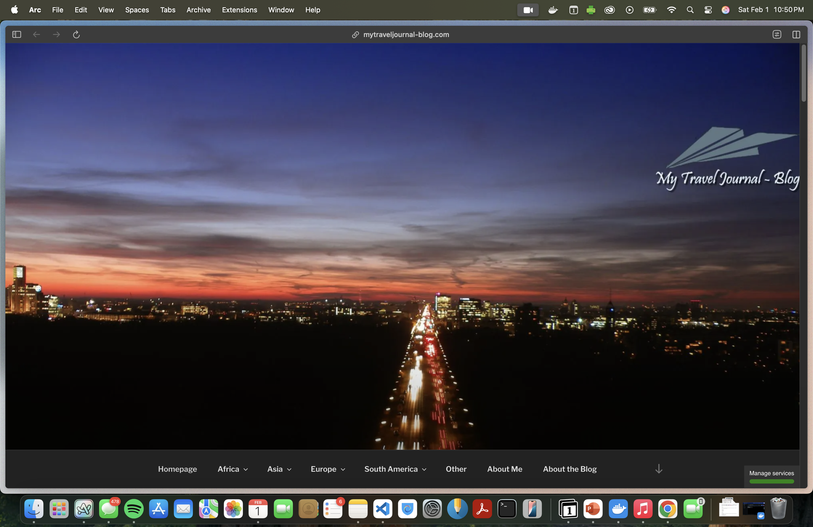
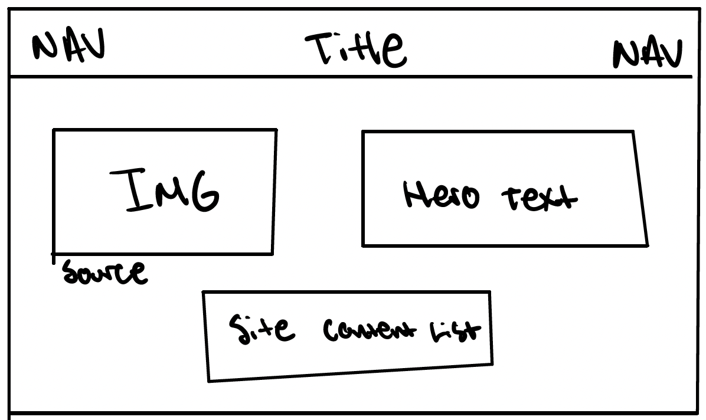
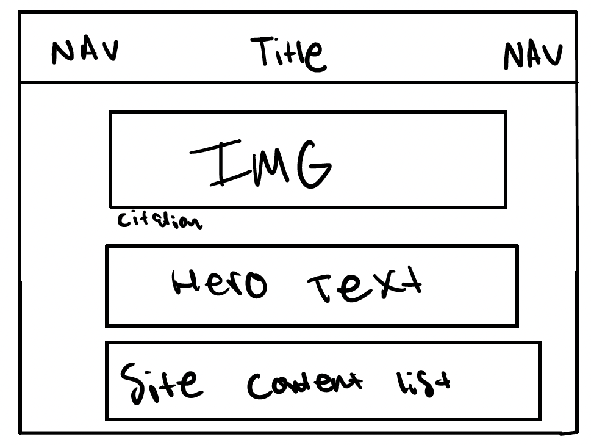
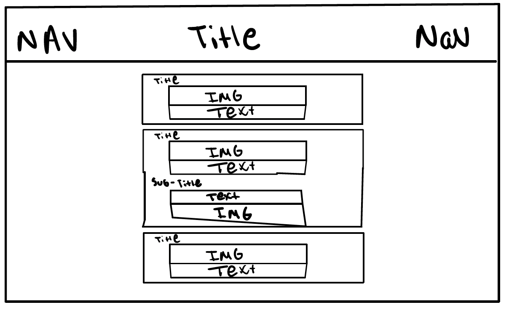
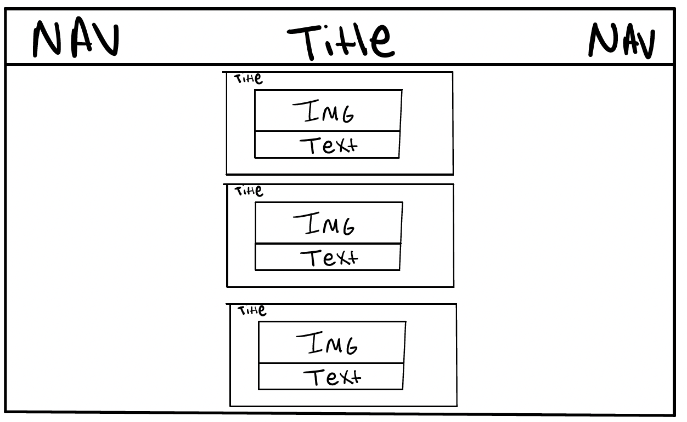
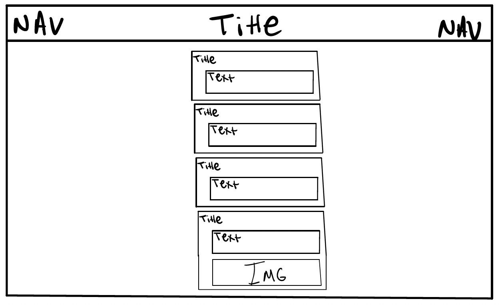
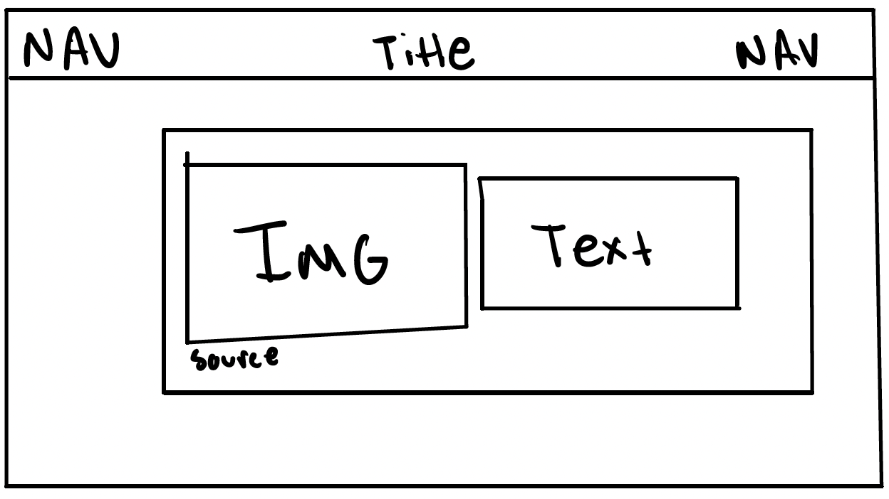

# Project 1, Final Milestone: Design Journey

## Milestone 3 Feedback Revisions
> Explain what you revised in response to the Milestone 3 feedback (1-2 sentences)
> If you didn't make any revisions, explain why.

No changes were made. I followed all the instructions and reviewed the class slides to ensure I used the correct format and style.

## Example Website Emotion Analysis

For each example website you identified in milestone 1:

1. Include the same screenshot of the example website you included in Milestone 1.
2. Reflect on the emotions your experience when using the website.
3. Analyze how the website's use of color, decorative imagery, typography, shape, and alignment contribute to these emotions.

### Example Website 1
> Provide the website's URL and a screenshot

<https://mytraveljournal-blog.com/>

> What emotions do you feel when you look at this website's design? (1 sentence)

The design evokes a sense of personal adventure and warmth, inviting readers to join the author's journeys.

> How does this website's use of color, decorative imagery, typography, shape, and alignment contribute to these emotions? (2-3 sentences)

The website uses a soft, neutral color palette with small appearances of warm colors, making a calm and welcoming feel. Large travel images are mostly the layout, putting the visitors in different locations and adding a personal storytelling aspect. The clean typography is easy to read, and the structured yet slightly informal alignment makes the site feel approachable and personal.

### Example Website 2
> Provide the website's URL and a screenshot

<https://expertvagabond.com/>

> What emotions do you feel when you look at this website's design? (1 sentence)

The site creates excitement, professionalism, and a spirit of exploration, inspiring visitors to go on their own adventures.

> How does this website's use of color, decorative imagery, typography, shape, and alignment contribute to these emotions? (2-3 sentences)

This site uses bold, high-contrast colors like blue and orange to create an energetic and adventurous feel. The large images of destinations and action shots immediately capture attention. The typography is modern and professional, with a clear hierarchy, while the layout makes good navigation and usability.

## Website Design

### Emotion Reflection
> What emotions would you like the visitors of your website to experience? Why? (1-2 sentences)

I want visitors to feel engaged and curious, just like reading a book for the plot. My goal is to make my travel stories compelling so that they keep reading, eager to see what happens next.

### Design Principle Brainstorm
> Reflect on how you might use color, decorative imagery, typography, shape, and alignment to evoke these emotions. (2-3 sentences)

I will use warm, inviting colors to make the site feel like a book you want to keep reading. Travel photos will make the stories more interesting and engaging. A classic font for titles and a simple, readable font for the text will give it a book-like feel, while a clear layout will keep everything easy to follow.

### Home Page Sketches
> Sketch **two** different possible designs for your home page.
> Provide an explanation for each sketch explaining the idea. (1 sentence per sketch)

- Sketch 1:

- Sketch 2:

### Entire Website's Design
> Pick the version of the home page that you will use for your final design.

I will I use sketch 2 to have clean and minimalist design.

> Plan the design for the rest of your website.
> Include a sketch for each of the remaining pages of your website.
> Label each sketch, so that we understand what page we are reviewing. (1 short phrase per sketch)

This is the destination page:

This is the travel stories page:

This is the tips page:

This is the contact page:

### Static Website Design Check
> We're building a static website without interactivity.
> **No part of your website may dynamically change.**
> Examples of dynamic behavior are dropdown menus, hamburger menus, popups, modals/lightboxes, image carousels, etc.
> Audit your design and check that you aren't relying on any dynamic features. (1 sentence)

My website is completely static because it does not contain any interactive elements such as dropdown menus, popups, modals, or JavaScript-based dynamic content. All content is displayed using static HTML and CSS, and no part of the site changes based on user interactions beyond simple CSS hover effects, which are allowed within a static design.

## Self-Reflection
> Take some time here to reflect on how much you've learned since you started this class. It's often easy to ignore our own progress. Take a moment and think about your accomplishments in this class. Hopefully you'll recognize that you've accomplished a lot and that you should be very proud of those accomplishments!

Since starting this project, I have significantly improved my understanding of HTML and CSS. At first, I struggled with layout concepts like Flexbox and proper semantic HTML structuring, but now I can confidently build well-organized static websites with clean, readable code. Learning about color theory, typography, and alignment has also helped me create more visually appealing designs. I'm proud of how much I’ve learned and feel much more comfortable working on web projects independently.

## References

### Collaborators
> List any persons you collaborated with on this project.

I am working on this project alone.

### Reference Resources
> Did you use any resources not provided by this class to help you complete this assignment?
> List any external resources you referenced in the creation of your project. (i.e. W3Schools, StackOverflow, Mozilla, etc.)
>
> List **all** resources you used (websites, articles, books, etc.), including generative AI.
> Provide the URL to the resources you used and include a short description of how you used each resource.

- <https://chatgpt.com/> - Content used for this site has been generated by generative AI.
- <https://pixabay.com/photos/airplane-adventure-travel-221526/> - This is an image being used
- <https://pixabay.com/photos/eiffel-tower-france-paris-landscape-975004/> - This is an image being used
- <https://pixabay.com/photos/shibuya-crossing-tokyo-japan-asia-923000/> - This is an image being used
- <https://pixabay.com/photos/buildings-bridge-illuminated-1835647/> - This is an image being used
- <https://pixabay.com/photos/sushi-menu-restaurant-food-kitchen-8113165/> - This is an image being used
- <https://pixabay.com/photos/cobblestone-street-city-europe-5451174/> - This is an image being used
- <https://pixabay.com/photos/granville-street-vancouver-canada-3686936/> - This is an image being used
- <https://pixabay.com/photos/bali-mount-batur-mountain-volcano-4880742/> - This is an image being used
- <https://pixabay.com/photos/suitcase-antique-teddy-1650171/> - This is an image being used
- <https://pixabay.com/photos/passport-map-world-trip-tourism-2714675> - This is an image being used
