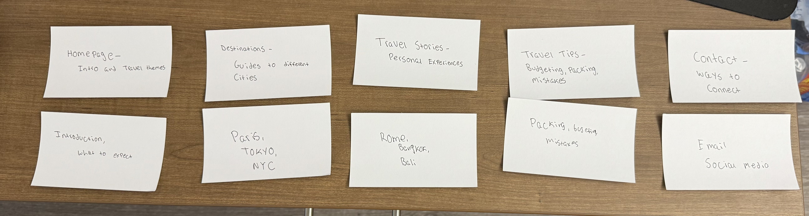
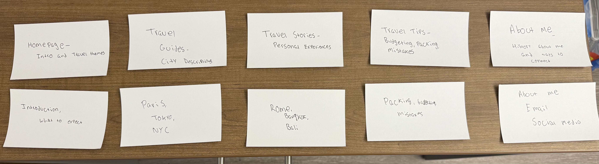

# Project 1, Milestone 2: Design Journey

## Milestone 1 Feedback Revisions
> Explain what you revised in response to the Milestone 1 feedback (1-2 sentences)
> If you didn't make any revisions, explain why.

I revised my index.html to add citations for the generated content created by ChatGPT.

## Information Architecture

Design the information architecture for all the pages your website.

You may change your homepage content based on your card sorting. If you do change the homepage content, you don't need to go back to the previous milestone design journey and update it. Instead, just include the new plan in the section below (Content Organization).

### Content Organization
> Document your **iterations** of card sorting here.
> You should have at least 2 iterations of card sorting.
> Include photographic evidence of each iteration of card sorting **and** description of your thought process for each iteration. (1-2 sentences)
> Please physically sort cards; please don't do this digitally.

#### **First Card Sorting Iteration**

In the first attempt, I grouped content strictly by topic (e.g., Travel Stories, Destinations, Travel Tips, Contact).
However, some sections felt too separate, and navigation between them seemed less intuitive.

#### **Second Card Sorting Iteration**

In this version, I combined "Contact" with "About Me" because most users expect them together. I renamed "Destinations" to "Travel Guides" for better clarity. I made sure each page has a clear focus and flows naturally from one to another.

### Final Content Organization
> Which iteration of card sorting will you use for your website? (1 sentence)

I will use the first iteration because it provides a clear separation between travel guides, personal stories, and travel tips, making navigation more intuitive.

> Explain how the final organization of content is appropriate for your site's audiences. (1-2 sentences)

This structure ensures that visitors can easily navigate between practical travel information, personal experiences, and planning tips. The separation between destination guides and travel stories makes it simpler for users to find exactly what they are looking for without unnecessary overlap.

### Navigation
> Please list the pages you will include in your website's navigation.

- Home
- Destinations
- Travel Stories
- Travel Tips
- Contact

> Explain why the names of these pages make sense for your site's audience. (1-2 sentences)

The page names are simple and self-explanatory, making it easy for visitors to quickly understand where to find relevant information. The separation between “Destinations” and “Travel Stories” ensures that users who are looking for factual travel information do not have to sift through personal narratives.

## References

### Collaborators
> List any persons you collaborated with on this project.

I am working on this project alone.

### Reference Resources
> Did you use any resources not provided by this class to help you complete this assignment?
> List any external resources you referenced in the creation of your project. (i.e. W3Schools, StackOverflow, Mozilla, etc.)
>
> List **all** resources you used (websites, articles, books, etc.), including generative AI.
> Provide the URL to the resources you used and include a short description of how you used each resource.

- <https://chatgpt.com/> - Content used for this site has been generated by generative AI.
- <https://pixabay.com/photos/airplane-adventure-travel-221526/> - This is an image being used
- <https://pixabay.com/photos/eiffel-tower-france-paris-landscape-975004/> - This is an image being used
- <https://pixabay.com/photos/shibuya-crossing-tokyo-japan-asia-923000/> - This is an image being used
- <https://pixabay.com/photos/buildings-bridge-illuminated-1835647/> - This is an image being used
- <https://pixabay.com/photos/sushi-menu-restaurant-food-kitchen-8113165/> - This is an image being used
- <https://pixabay.com/photos/cobblestone-street-city-europe-5451174/> - This is an image being used
- <https://pixabay.com/photos/granville-street-vancouver-canada-3686936/> - This is an image being used
- <https://pixabay.com/photos/bali-mount-batur-mountain-volcano-4880742/> - This is an image being used
- <https://pixabay.com/photos/suitcase-antique-teddy-1650171/> - This is an image being used
- <https://pixabay.com/photos/passport-map-world-trip-tourism-2714675> - This is an image being used
