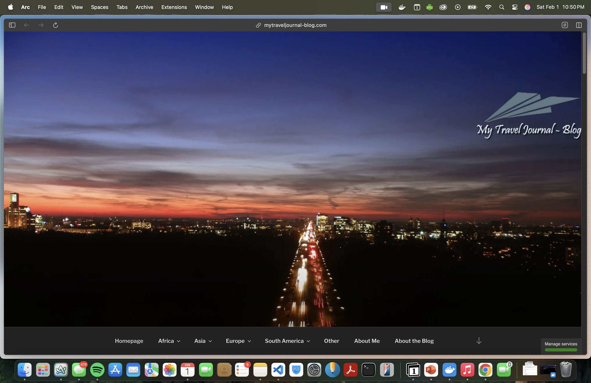

# Project 1, Milestone 3: Design Journey

## Milestone 2 Feedback Revisions
> Explain what you revised in response to the Milestone 2 feedback (1-2 sentences)
> If you didn't make any revisions, explain why.

No changes were made. I followed all the instructions and reviewed the class slides to ensure I used the correct format and style.

## Example Website CSS Property Analysis

For each example website you identified in milestone 1:

1. Include the same screenshot of the example website you included in Milestone 1.
2. Identify 2 parts of the design that you want to analyze for CSS properties.
3. For each part of the design, list the CSS properties for shape, color, and typography that you might use to create a similar design on your personal website.

### Example Website 1 CSS Property Analysis

<https://expertvagabond.com/>

1. The main navigation bar of the header, which contains the website logo on the left and several menu items ("DESTINATIONS," "TRAVEL TIPS," "TRAVEL GEAR," "NOMADIC LIFE") aligned horizontally. On the far right, there is a search icon. The navigation bar has a dark gray background with an orange bottom border.

    Shape CSS Properties:

      - min-height: 60px; -> Defines the height of the header.
      - border-bottom: 4px solid #ff8a00; -> Creates a distinct orange border at the bottom.

    Color CSS Properties:

      - background-color: #222222; -> Dark gray background for contrast.
      - color: #ffffff; (inferred) -> White text for readability.

    Typography CSS Properties:

      - font-family: Helvetica Neue, Arial, Helvetica, sans-serif; -> Uses a clean sans-serif font.
      - font-size: 1.125rem; -> Increases text size slightly for better readability.

2. The footer section at the bottom of the website contains three main columns: "Travel Resources" (links to travel tips and guides), "Social Media" (icons for Instagram, YouTube, and Twitter), and "Nomadic Living" (links to digital nomad guides and visa information). It has a black background with white text and is divided into sections with bolded headings.

    Shape CSS Properties:

      - display: block; -> Ensures the footer is treated as a block-level element, spanning the full width.
      - box-sizing: border-box; -> Ensures padding and borders are included in the element’s total width and height, maintaining consistent sizing.

    Color CSS Properties:

      - background-color: #000000; -> The footer has a solid black background for contrast.
      - color: #fff; -> The text is white to make it readable against the dark background.

    Typography CSS Properties:

      - font-size: .875rem; -> Slightly smaller text to differentiate the footer from the main content.
      - font-weight: 400; -> Regular text weight, except for the bold section headings.

### Example Website 2 CSS Property Analysis

<https://mytraveljournal-blog.com/>

1. The interactive travel map displays countries the vlogger has visited. The map has a dark background with light gray landmasses, while the visited countries are highlighted in a soft green color. When hovering over a country, a tooltip appears, providing additional information about that destination.

    Shape CSS Properties:

      - box-sizing: border-box; -> Ensures that borders and padding are included in the total size of elements within the map.
      - display: block; -> Makes the map a block-level element so it behaves as a separate component.

    Color CSS Properties:

      - background-color: #222222; -> Dark background for contrast.
      - color: #6EC1E4; -> Light blue text for the section title.

    Typography CSS Properties:

      - font-family: "Roboto", sans-serif; -> Uses a modern sans-serif font.
      - font-size: 1.125rem; -> Larger text for emphasis on the section heading.

2. The navigation bar contains menu items for different continents and blog-related sections, such as "Homepage," "Africa," "Asia," "Europe," "South America," "Other," "About Me," and "About the Blog." The dark background contrasts with the lighter text, making the navigation options clear.

    Shape CSS Properties:

      - border-bottom-color: #333; -> Adds a subtle bottom border for separation.
      - border-top-color: #333; -> Defines the top border for visual balance.

    Color CSS Properties:

      - background: #222; -> Dark background for a sleek, minimalistic appearance.
      - color: #eee; -> Light gray text for contrast against the dark background.

    Typography CSS Properties:

      - font-family: "Libre Franklin", sans-serif; -> Uses a clean sans-serif font for readability
      - font-size: 0.9375rem; -> Maintains a balanced text size for navigation items.

## CSS Styling Plan
> Pick one of the examples websites, or parts from each website, to use as inspiration to begin styling your personal website.
> Explain why you chose the example website, or parts from each, and how you plan to use it as inspiration for styling your personal website.

I will use Expert Vagabond’s navigation bar section as inspiration for my personal website.

I chose this navigation bar because of its dark background and contrast with a highlighted accent color for clarity. I plan to apply a similar high-contrast header with clean typography and a well-structured menu.

## References

### Collaborators
> List any persons you collaborated with on this project.

I am working on this project alone.

### Reference Resources
> Did you use any resources not provided by this class to help you complete this assignment?
> List any external resources you referenced in the creation of your project. (i.e. W3Schools, StackOverflow, Mozilla, etc.)
>
> List **all** resources you used (websites, articles, books, etc.), including generative AI.
> Provide the URL to the resources you used and include a short description of how you used each resource.

- <https://chatgpt.com/> - Content used for this site has been generated by generative AI.
- <https://pixabay.com/photos/airplane-adventure-travel-221526/> - This is an image being used
- <https://pixabay.com/photos/eiffel-tower-france-paris-landscape-975004/> - This is an image being used
- <https://pixabay.com/photos/shibuya-crossing-tokyo-japan-asia-923000/> - This is an image being used
- <https://pixabay.com/photos/buildings-bridge-illuminated-1835647/> - This is an image being used
- <https://pixabay.com/photos/sushi-menu-restaurant-food-kitchen-8113165/> - This is an image being used
- <https://pixabay.com/photos/cobblestone-street-city-europe-5451174/> - This is an image being used
- <https://pixabay.com/photos/granville-street-vancouver-canada-3686936/> - This is an image being used
- <https://pixabay.com/photos/bali-mount-batur-mountain-volcano-4880742/> - This is an image being used
- <https://pixabay.com/photos/suitcase-antique-teddy-1650171/> - This is an image being used
- <https://pixabay.com/photos/passport-map-world-trip-tourism-2714675> - This is an image being used
